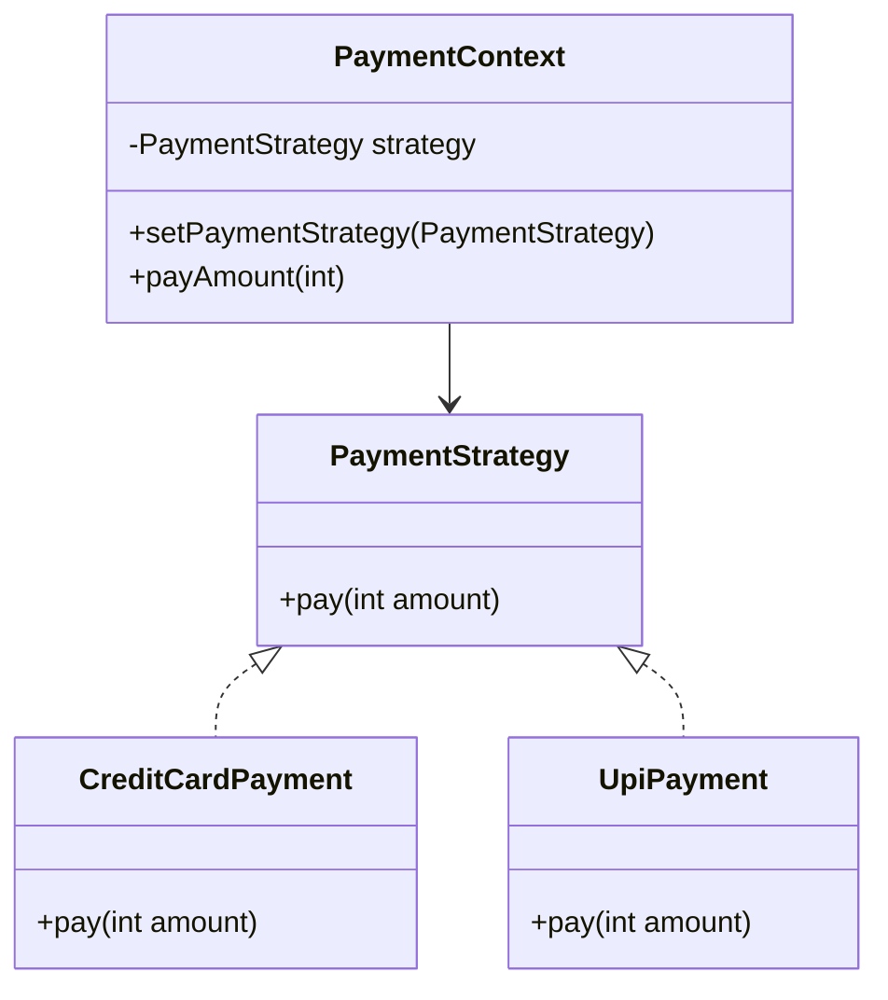
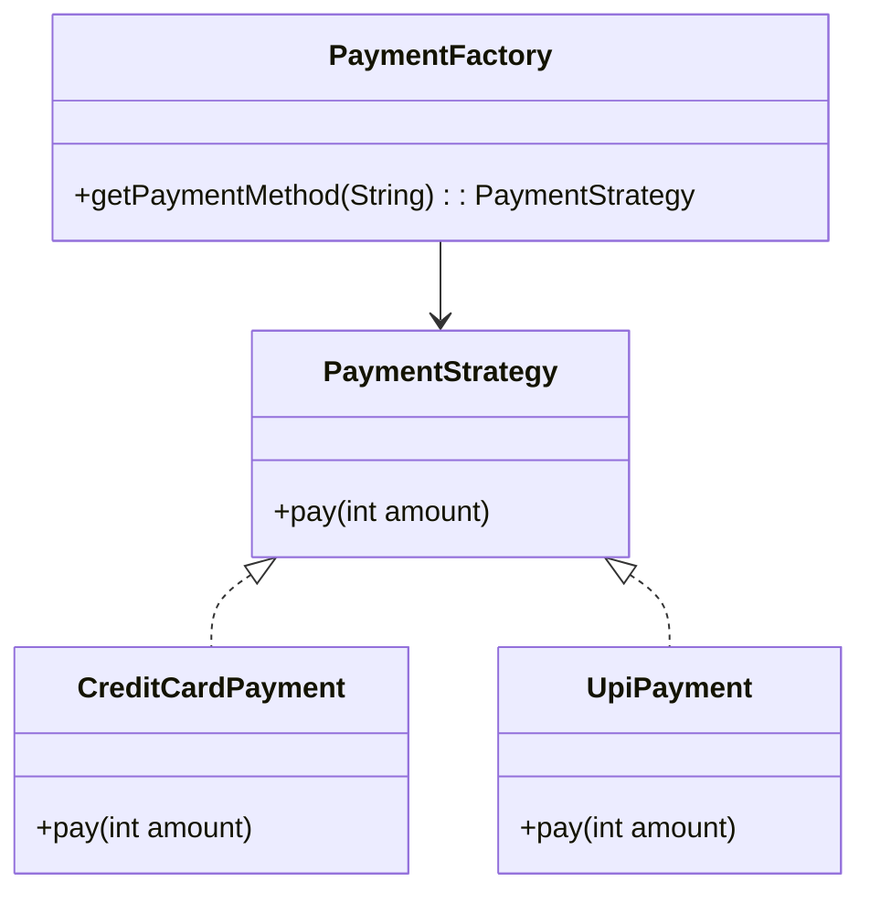

# Strategy vs Factory Pattern in Java

---

## 🎯 Strategy Pattern
- **Purpose:** Define a family of algorithms/behaviors and make them interchangeable at runtime.
- **Focus:** **Behavior / Algorithm selection**.
- **Who decides?** The **client** sets the strategy at runtime.
- **When used?** When you want to change the **way something is done** without modifying the calling code.

### UML (Mermaid Flowchart)


### Example Code
```java
// Strategy Interface
public interface PaymentStrategy {
    void pay(int amount);
}

// Concrete Implementations
public class CreditCardPayment implements PaymentStrategy {
    private String cardNumber;
    public CreditCardPayment(String cardNumber) {
        this.cardNumber = cardNumber;
    }
    @Override
    public void pay(int amount) {
        System.out.println("Paid " + amount + " using Credit Card: " + cardNumber);
    }
}

public class UpiPayment implements PaymentStrategy {
    private int upiId;
    public UpiPayment(int upiId) {
        this.upiId = upiId;
    }
    @Override
    public void pay(int amount) {
        System.out.println(upiId + " paid " + amount);
    }
}

// Context
public class PaymentContext {
    private PaymentStrategy strategy;
    public void setPaymentStrategy(PaymentStrategy strategy) {
        this.strategy = strategy;
    }
    public void payAmount(int amount) {
        strategy.pay(amount);
    }
}

// Usage
public class StrategyPatternDemo {
    public static void main(String[] args) {
        PaymentContext context = new PaymentContext();
        context.setPaymentStrategy(new CreditCardPayment("1234"));
        context.payAmount(500);

        context.setPaymentStrategy(new UpiPayment(4689));
        context.payAmount(200);
    }
}
```

**Output**
```
Paid 500 using Credit Card: 1234
4689 paid 200
```

---

## 🏭 Factory Pattern
- **Purpose:** Encapsulate the logic of **object creation**.
- **Focus:** **Object creation / Instantiation**.
- **Who decides?** The **factory** decides which object to create, often based on input.
- **When used?** When you want to hide complex instantiation logic or centralize object creation.

### UML (Mermaid Flowchart)


### Example Code
```java
// Factory
public class PaymentFactory {
    public static PaymentStrategy getPaymentMethod(String type) {
        switch (type) {
            case "CREDIT": return new CreditCardPayment("1234");
            case "UPI": return new UpiPayment(4689);
            default: throw new IllegalArgumentException("Unknown payment type");
        }
    }
}

// Usage
public class FactoryPatternDemo {
    public static void main(String[] args) {
        PaymentStrategy strategy = PaymentFactory.getPaymentMethod("UPI");
        strategy.pay(200);

        PaymentStrategy credit = PaymentFactory.getPaymentMethod("CREDIT");
        credit.pay(500);
    }
}
```

**Output**
```
4689 paid 200
Paid 500 using Credit Card: 1234
```

---

## 🆚 Strategy vs Factory

| Aspect | **Strategy Pattern** | **Factory Pattern** |
|--------|----------------------|----------------------|
| **Intent** | Define a **family of algorithms/behaviors** and make them interchangeable at runtime. | Encapsulate **object creation logic**, centralizing how objects are instantiated. |
| **Focus** | **Behavior / Algorithm selection**. | **Object creation / Instantiation**. |
| **Who decides?** | **Client** sets the strategy at runtime. | **Factory** decides which object to return. |
| **When used?** | To change **how something is done**. | To hide **how an object is created**. |
| **Example Analogy** | You already have a car 🚗, but can **switch driving modes** (Eco, Sport, Comfort). | A **car factory** 🏭 produces different car types (SUV, Sedan, Hatchback). |
| **Java Example** | `Comparator` in `Collections.sort(list, comparator)`. | `Calendar.getInstance()` or `DocumentBuilderFactory.newInstance()`. |

---

## 🔑 Real-World Examples

### Strategy
- `Comparator` interface in Java (`Collections.sort()`)
- `Runnable` in multithreading
- `Encryption algorithms` where you can swap strategies

### Factory
- `DocumentBuilderFactory.newInstance()`
- `Calendar.getInstance()`
- `NumberFormat.getInstance()`
- `Spring BeanFactory`


---
