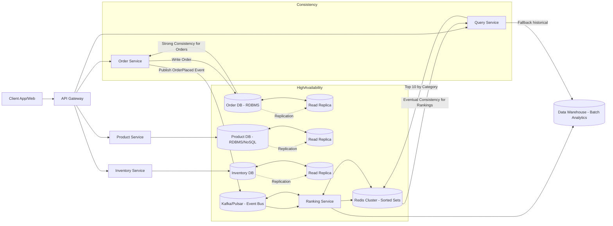
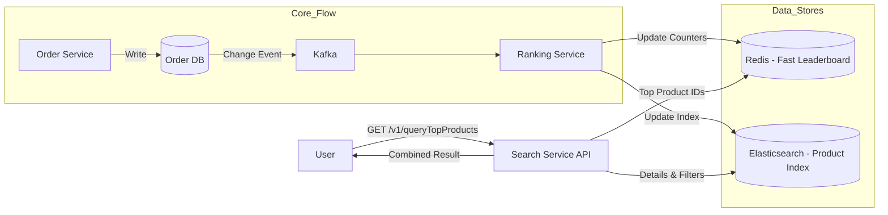
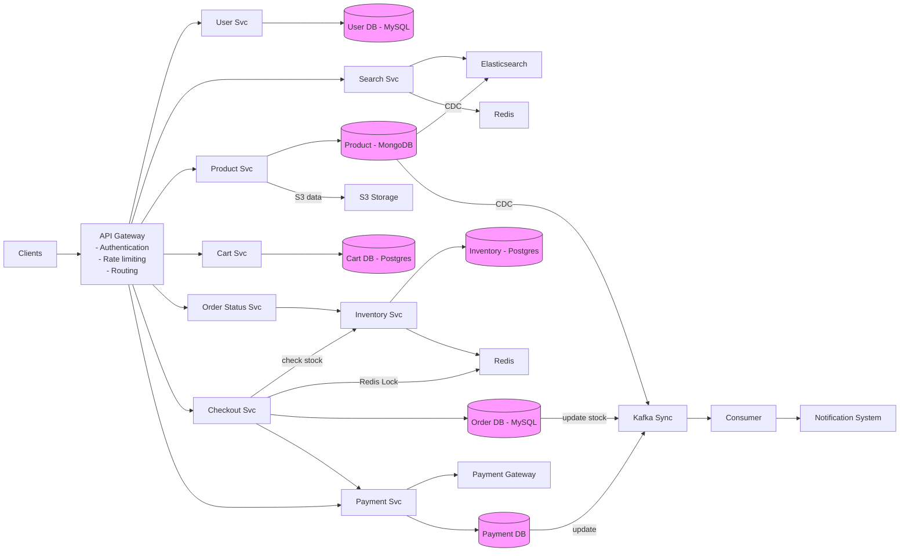
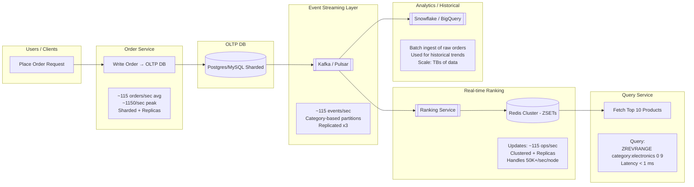

## 🔹 Requirements

### Functional:

* Store products, categories, and inventory details.
* Record each **order** placed.
* Fetch **Top 10 most ordered products per category**.
* Real-time/near-real-time ranking.

### Non-functional:

* Scalability (millions of products/orders).
* High availability (24/7 uptime).
* Low-latency queries (<200ms for top 10 fetch).
* Consistency (eventual consistency is okay for rankings).

---

## 🔹 High-Level Components

1. **Client** (Web/Mobile App).
2. **API Gateway** → Routes requests.
3. **Order Service** → Handles new orders, persists order data.
4. **Product Service** → Manages product & category metadata.
5. **Inventory Service** → Manages stock updates.
6. **Analytics/Ranking Service** → Maintains top products by category.
7. **Databases**:

    * **Order DB** (OLTP) → transactional order records (e.g., MySQL/Postgres).
    * **Product DB** → product info, category mapping.
    * **Cache/Ranking Store** → Redis/ElasticSearch for fast "Top 10 by category".
    * **Data Warehouse** (BigQuery/Snowflake) → batch analysis.
8. **Message Queue/Event Bus** (Kafka/Pulsar) → async updates for ranking service.

---

## 🔹 Data Flow (Top 10 Products by Category)

1. **User places order** → Order Service saves to **Order DB**.
2. Order Service publishes **OrderPlaced event** to Kafka.
3. **Ranking Service** consumes events:

    * Updates counters in **Redis** (`categoryId:productId → orderCount`).
    * Maintains **SortedSet per category** (`ZADD categoryId productId score`).
4. Query:

    * Client → API Gateway → Ranking Service → Redis (`ZREVRANGE categoryId 0 9`).
    * Returns **Top 10 products by order count**.

---

## 🔹 Storage Choices

* **Order DB** → Relational (ensures ACID for orders).
* **Ranking/Cache** → Redis Sorted Sets (fast O(logN) inserts, O(10) retrieval).
* **Warehouse** → For offline trends, batch reports.

---

## 🔹 HLD Diagram (textual)

```
          +-------------------+
          |    Client (App)   |
          +--------+----------+
                   |
             API Gateway
                   |
        +----------+------------+
        |                       |
   Order Service           Product Service
        |                       |
   +----v----+           +------v------+
   | OrderDB |           | Product DB  |
   +---------+           +-------------+
        |
   Publish Event
   (Kafka/Pulsar)
        |
   +----v------------------+
   |   Ranking Service     |
   | (consumes events)     |
   +----------+------------+
              |
        +-----v------+
        |  Redis     |  <-- SortedSet(categoryId -> Top10)
        +------------+
              |
         Client Query
              |
          Top 10 Products
```

---

## 🔹 Scaling

* **Sharding in Redis** by category ID.
* **Kafka partitioning** by category → parallel consumers.
* **Caching at API layer** for repeated queries.

---

Perfect 👌 Let’s create an **end-to-end HLD diagram in Mermaid** for an **Inventory system like Amazon/Flipkart** that supports **Top 10 most-ordered products by category**.

This will include services, data stores, event flow, HA (high availability), and consistency strategy.

---

## 📌 Mermaid Diagram



---

## 🔹 Explanation

### Services

1. **API Gateway** – Entry point, handles auth, rate limiting, routing.
2. **Order Service** – Processes new orders, writes to **Order DB**, publishes **OrderPlaced** events.
3. **Product Service** – Stores metadata (name, category, price).
4. **Inventory Service** – Updates stock levels.
5. **Ranking Service** – Consumes events, updates **Redis** counters (per category).
6. **Query Service** – Reads **Top 10 products** per category from Redis, falls back to DW if needed.

### Storage

* **Order DB, Product DB, Inventory DB** → RDBMS (MySQL/Postgres), replicated for HA.
* **Redis Cluster** → stores rankings (Sorted Sets, O(logN) updates, O(10) queries).
* **Message Queue (Kafka/Pulsar)** → async event pipeline.
* **Data Warehouse (Snowflake/BigQuery/Redshift)** → historical trends & analytics.

### HA (High Availability)

* **DBs** → Primary + Replicas.
* **Redis Cluster** → sharded + replicated (failover support).
* **Kafka/Pulsar** → multiple partitions, replication factor ≥ 3.
* **Services** → stateless, horizontally scalable behind Load Balancer.

### Consistency

* **Orders/Inventory** → Strong consistency (RDBMS, ACID).
* **Rankings (Top 10)** → Eventual consistency (Redis updated from Kafka).
* Users may see slight delay in rankings but orders are guaranteed accurate.

Great question Rajat 👍

Using **Redis Cluster** (instead of a single Redis instance) is all about **scalability, high availability, and performance**. Let me explain in context of your **Amazon/Flipkart Top 10 products by category** system design.

---

## 🔹 Why Redis Cluster?

### 1. **Sharding / Horizontal Scalability**

* Single Redis = limited by **one machine’s memory/CPU**.
* Redis Cluster automatically **shards data across multiple nodes**.

   * Example:

      * `category:electronics` → Node A
      * `category:books` → Node B
      * `category:fashion` → Node C
* This means you can handle **millions of categories/products** without running out of memory.

---

### 2. **High Availability (HA)**

* In **Redis Cluster**, each shard has a **primary + replicas**.
* If a primary node fails → a replica is promoted automatically.
* This ensures **no single point of failure** for rankings (critical for e-commerce).

---

### 3. **Performance**

* Queries like **“Top 10 products per category”** use Redis **Sorted Sets (ZSET)**.
* In a cluster:

   * Writes (increment counters) → distributed across shards.
   * Reads (fetch top 10) → parallelized.
* You get **low latency (<1 ms ops)** even with **10M+ updates/day**.

---

### 4. **Eventual Consistency for Analytics**

* Orders are strongly consistent in OLTP DB.
* Rankings in Redis (cluster) can be **eventually consistent** since slight delays are acceptable.
* Redis Cluster handles **high write throughput** (Kafka → Ranking Service → Redis).

---

### 5. **Elastic Growth**

* Start with 3 nodes, scale to 10, 20, 50 nodes as traffic grows.
* You don’t need to redesign the system → Redis Cluster rebalances shards.

---

## 🔹 Example in your HLD

When a new order event comes in:

1. Ranking Service updates Redis Cluster:

   ```redis
   ZINCRBY category:electronics 1 product:123
   ```

   (increment order count of product 123 in electronics).

2. Query Service fetches top 10:

   ```redis
   ZREVRANGE category:electronics 0 9 WITHSCORES
   ```

   Returns top 10 products in electronics with counts.

➡️ Without Redis Cluster → one node would choke under high volume.
➡️ With Redis Cluster → load is distributed across multiple shards.


| Feature          | **Redis**                                               | **Elasticsearch**                                    |
| ---------------- | ------------------------------------------------------- | ---------------------------------------------------- |
| **Nature**       | In-memory key-value store                               | Distributed search & analytics engine                |
| **Data Model**   | Sorted Sets (`ZSET` → perfect for Top-K rankings)       | Inverted index (optimized for search & aggregations) |
| **Latency**      | Sub-millisecond reads/writes                            | ~10-100 ms (depends on query complexity)             |
| **Use Case Fit** | Best for **real-time leaderboards, counters, rankings** | Best for **search, filtering, full-text, analytics** |
| **Scalability**  | Redis Cluster → sharding by key (categoryId)            | Elasticsearch shards data automatically              |
| **Consistency**  | Eventual consistency (via Kafka events)                 | Eventual consistency (index refresh interval ~1s)    |
| **Storage**      | RAM (can persist to disk, but memory-heavy)             | Disk-based (handles TBs of data easily)              |
| **Cost**         | Expensive for large datasets (memory-bound)             | Cheaper for large datasets (disk-based)              |
| **Querying**     | Simple (top-N, counters, TTL)                           | Complex (filter by category, price, date, full-text) |

---

⚡ **In short:**
Redis Cluster = **Scalable, Highly Available, Distributed Redis** → critical for handling **millions of orders, categories, and queries in real-time** at Amazon/Flipkart scale.

Here you go Rajat 👍 — a **simplified overall picture** in Mermaid, without replicas/shards, just the main services and data flow:



---

✅ This captures the **end-to-end flow** clearly:

* **Order Service** updates DB → event published.
* **Ranking Service** updates **Redis** + **Elasticsearch**.
* **Search Service API** queries both, merges response, and returns to user.

Perfect Rajat 👍 I’ll translate the architecture from your uploaded diagram into **Mermaid syntax**. Here’s the **end-to-end flow** in text form so you can render it anywhere that supports Mermaid:



---

✅ **What this captures from your diagram**:

* **API Gateway** routes traffic to different services.
* **User Service** → MySQL, Redis, Elasticsearch.
* **Product Service** → MongoDB with CDC into Kafka + ES.
* **Cart Service** → Postgres.
* **Inventory Service** → Postgres + Redis.
* **Checkout Service** → interacts with Inventory + Redis Lock + Order DB.
* **Payment Service** → Payment Gateway + Payment DB + Kafka.
* **Notification System** → fed from Kafka consumer.

---
Perfect 👌 Rajat.
Here’s a **Mermaid diagram** that shows the **end-to-end flow**, with **per-second load details** and how each layer scales for **10M orders/day (~115 orders/sec, ~1150/sec peak)**.

---



---

### 🔹 How it Handles **Large Data (10M/day → 115/sec avg, 1150/sec peak)**

* **OLTP DB** → sharded, replicas → supports writes at scale.
* **Kafka** → partitioned, replicated → handles millions/sec easily.
* **Redis Cluster** → handles updates in **<1 ms**, 50K+ ops/sec/node.
* **Query Service** → instant top 10 lookups.
* **Snowflake** → stores billions of rows for offline analytics.

⚡ This design ensures **high availability, low latency, and eventual consistency** for ranking.

---

