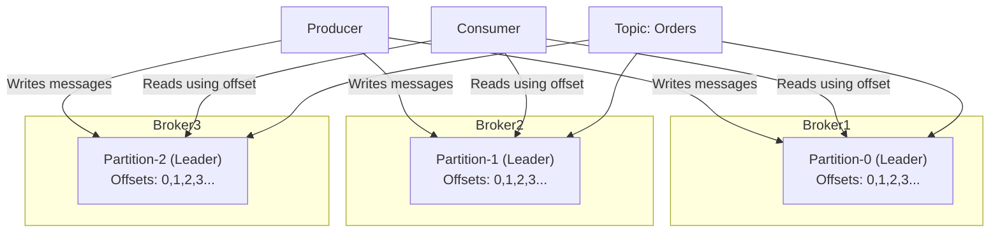

# Apache Kafka Internals

## 🔹 Kafka Brokers
- A **Broker** is a Kafka server that stores and serves topic data.
- Each broker:
  - Hosts **partitions** of topics.
  - Handles **producer writes** and **consumer reads**.
  - Coordinates with other brokers using **ZooKeeper** (legacy) or **KRaft** (newer versions).

---

## 🔹 Topics and Partitions
- A **topic** is a logical grouping of messages (e.g., `orders`, `tweets`).
- Each topic is divided into **partitions**:
  - Each partition is an **append-only log** file.
  - Messages inside a partition have an **offset** (unique index).
- A partition has:
  - **1 leader** → handles all reads/writes.
  - **0 or more followers** → replicate data for fault tolerance.

---

## 🔹 How Data Flows in Kafka
1. Producer sends a record → goes to a **partition** of a topic.
2. Leader broker writes record to disk.
3. Followers replicate the record.
4. Consumers read messages from partitions.
5. Consumers track **offsets** in `__consumer_offsets`.

---

## 🔹 Increasing Kafka Throughput
1. **Increase partitions** → more parallelism.
2. **Batching** (`batch.size`, `linger.ms`) → fewer network round-trips.
3. **Compression** (`gzip`, `lz4`, `snappy`, `zstd`) → reduce bandwidth.
4. **Replication tuning**:
   - `acks=0` → fastest, unsafe.
   - `acks=1` → leader only.
   - `acks=all` → safest, slower.
5. **Consumer scaling** → more instances in a consumer group.
6. **Hardware tuning** → SSDs, high network bandwidth, OS page cache.
7. **Cluster scaling** → add brokers, rebalance partitions.

---

## 🔹 Kafka Architecture Diagram (Mermaid)

```mermaid
graph TD

    subgraph Producers
        P1[Producer 1]
        P2[Producer 2]
    end

    subgraph KafkaCluster
        B1[Broker 1]
        B2[Broker 2]
        B3[Broker 3]

        T1P0[(TopicA-Partition0 - Leader on B1)]
        T1P1[(TopicA-Partition1 - Leader on B2)]
        T1P2[(TopicA-Partition2 - Leader on B3)]

        B1 --> T1P0
        B2 --> T1P1
        B3 --> T1P2

        T1P0 -.replica.-> B2
        T1P1 -.replica.-> B3
        T1P2 -.replica.-> B1
    end

    subgraph Consumers
        C1[Consumer 1]
        C2[Consumer 2]
    end

    P1 -->|writes| T1P0
    P2 -->|writes| T1P1

    T1P0 -->|reads| C1
    T1P1 -->|reads| C2
    T1P2 -->|reads| C1
````
```mermaid
sequenceDiagram
participant P as Producer
participant LB as Leader Broker (Partition Leader)
participant FB as Follower Broker s
participant C as Consumer

    P->>LB: Send Message (produce request)
    LB->>LB: Write message to log (append-only)
    LB->>FB: Replicate message (async/sync)
    FB-->>LB: Ack replication
    LB-->>P: Ack (based on acks config: 0, 1, all)

    C->>LB: Fetch messages (poll request)
    LB-->>C: Return batch of messages with offsets
    C->>LB: Commit offset __consumer_offsets
```

---
          Topic: orders
          ┌─────────────┐
          │ Partition 0 │───> Consumer C1 (group: order-service)
          ├─────────────┤
          │ Partition 1 │───> Consumer C2 (group: order-service)
          ├─────────────┤
          │ Partition 2 │───> Consumer C1 or C2 (balanced)
          └─────────────┘
          
          ┌─────────────┐
          │ Partition 0 │───> Consumer C3 (group: analytics-service)
          │ Partition 1 │───> Consumer C3
          │ Partition 2 │───> Consumer C3
          └─────────────┘

## 🔹 Summary

* **Brokers** → Servers that store and manage partitions.
* **Topics** → Logical data streams, split into partitions.
* **Leaders/Followers** → Ensure availability and replication.
* **Throughput optimizations** → Partitions, batching, compression, scaling.

---


