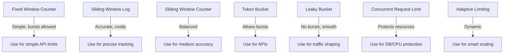

# Why Rate Limiters Are Used

Rate limiters are a **defensive mechanism** that control how many requests a user, client, or service can make in a given period of time. They are essential for protecting systems, ensuring fairness, and enforcing business policies.

---

## 🔑 Key Reasons

### 1. Prevent Abuse & DDoS Attacks
- Stop malicious clients from spamming millions of requests.
- Protects against brute-force login attempts or bot attacks.

### 2. Protect Backend Resources
- Prevents databases, caches, or external APIs from being overwhelmed.
- Ensures services continue to operate under heavy load.

### 3. Ensure Fair Usage
- Guarantees one user cannot monopolize resources.
- Example: free-tier API = 100 requests/min, premium = 1000 requests/min.

### 4. Reduce Costs
- Many third-party APIs charge per request.
- Rate limiting helps avoid runaway bills from excessive calls.

### 5. Improve Stability
- Smooths out sudden traffic spikes.
- Keeps systems responsive and avoids cascading failures.

### 6. Enforce Business Policies
- Enforce SLAs and API usage contracts.
- Differentiate usage between free, standard, and premium customers.

---

## 🌍 Real-World Examples

- **GitHub API** → 5000 requests per hour per user.
- **Twitter/X API** → free tier = 50 tweets/day, paid tiers get more.
- **AWS / Cloudflare API Gateway** → protects services from DDoS at the edge.
- **Login Systems** → allow only 5 attempts per minute to block brute force.

---

## 🎯 Analogy

A **rate limiter is like a traffic signal** 🚦 — it prevents too many cars (requests) from entering an intersection (system) at once, ensuring safety and smooth flow.

---


# Distributed Rate Limiter

This repository demonstrates a **Rate Limiter system** using the **Token Bucket algorithm** with support for distributed deployments using Redis.

---

# Rate Limiter Algorithms

Rate limiting is used to control the number of requests a client can make to a system within a given timeframe. Different algorithms exist, each with trade-offs in **accuracy, memory usage, and burst handling**.

---

## 1. Fixed Window Counter
- **Idea**: Maintain a counter per time window (e.g., 1 minute).
- Each request increments the counter. If it exceeds the threshold, requests are rejected until the window resets.

**Example**: Allow 100 requests per minute.

- ✅ Pros: Simple, low memory usage.
- ❌ Cons: Bursty traffic allowed at window edges.

---

## 2. Sliding Window Log
- **Idea**: Store timestamps of each request in a log.
- For each request, remove old entries outside the current window and count remaining requests.

**Example**: Allow 100 requests in the last 60 seconds.

- ✅ Pros: Very accurate.
- ❌ Cons: High memory usage, costly at scale.

---

## 3. Sliding Window Counter
- **Idea**: A hybrid of fixed window + sliding window.
- Divide the time into smaller windows (e.g., seconds within a minute).
- Apply weighted count of current + previous window to smooth burst handling.

**Example**: If 80 requests in previous window (weight 0.3) + 40 requests in current window (weight 0.7) = 64 effective requests.

- ✅ Pros: More accurate than fixed window, less memory than log.
- ❌ Cons: Still allows some bursts.

---

## 4. Token Bucket
- **Idea**: A "bucket" refills tokens at a fixed rate (e.g., 10 tokens/sec).
- Each request consumes a token. If the bucket is empty, requests are rejected or throttled.

- ✅ Pros: Allows bursts up to bucket size, smooths out requests.
- ❌ Cons: Needs precise refill mechanism.

**Use Case**: APIs that want to allow occasional bursts but enforce average rate.

---

## 5. Leaky Bucket
- **Idea**: Requests enter a bucket but leak out at a fixed rate.
- If the bucket overflows, requests are dropped.

- ✅ Pros: Smoothens out traffic spikes.
- ❌ Cons: Unlike token bucket, doesn’t allow bursts.

**Use Case**: Traffic shaping where steady flow is preferred.

---

## 6. Concurrent Request Limit
- **Idea**: Instead of rate, it limits the number of active requests at a time.

**Example**: Max 50 concurrent requests per user.

- ✅ Pros: Good for protecting resources like DB, CPU, memory.
- ❌ Cons: Doesn’t limit over time, only concurrency.

---

## 7. Adaptive / Dynamic Rate Limiting
- **Idea**: Adjust rate limits dynamically based on server load, error rates, or SLAs.

- ✅ Pros: Smart & self-adjusting, prevents overload gracefully.
- ❌ Cons: More complex to implement.

---

## 📌 Quick Comparison Table

| Algorithm              | Allows Burst? | Accuracy | Memory Usage | Best For |
|------------------------|---------------|----------|--------------|----------|
| Fixed Window Counter   | ✅            | Low      | Low          | Simple limits |
| Sliding Window Log     | ✅            | High     | High         | Precision needs |
| Sliding Window Counter | ✅            | Medium   | Medium       | Balanced accuracy |
| Token Bucket           | ✅            | High     | Low          | APIs, bursty traffic |
| Leaky Bucket           | ❌            | High     | Low          | Traffic shaping |
| Concurrency Limit      | N/A           | Medium   | Low          | Protecting resources |
| Adaptive               | Varies        | High     | Medium       | Dynamic systems |

---

## 📊 Visual (Mermaid Diagram)



## System Overview

The system limits API requests per user/IP over a configurable time window. It is designed to handle bursts while ensuring smooth rate limiting.

**Components:**

- **Client**: Sends API requests.
- **API Gateway / Middleware**: Intercepts requests and checks the rate limit.
- **RateLimiter Service**: Implements the Token Bucket logic.
- **Redis**: Stores token bucket state for distributed access.
- **Application Server**: Processes allowed requests.

---

## Rate Limiting Flow

```mermaid
sequenceDiagram
    participant Client
    participant APIGW as API Gateway / Middleware
    participant RL as RateLimiter Service
    participant Redis as Redis / Token Storage
    participant AppServer as Application Server

    Client ->> APIGW: Send API request
    APIGW ->> RL: Check rate limit
    RL ->> Redis: Fetch / Update tokens
    Redis -->> RL: Return token status

    alt Allowed
        RL ->> AppServer: Forward request
        AppServer -->> Client: Response
    else Rejected
        RL -->> Client: 429 Too Many Requests
    end

    Note right of RL: RateLimiter Logic:\n* Check token count\n* Refill tokens if needed\n* Consume token if allowed


