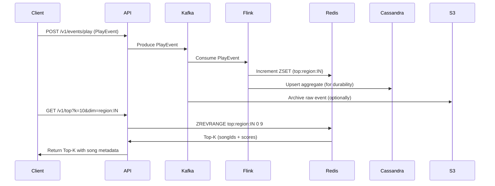
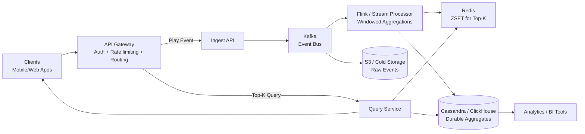

Nice — let’s design a clean, production-ready **High-Level Design (HLD)** for **“Top-K songs” (e.g., Top 10 / Top 100) in a music service like Spotify**. I’ll cover requirements, architecture, data model, stream processing, storage choices, APIs, scaling/capacity, consistency, failure handling, and monitoring. I'll finish with a compact Mermaid diagram to visualize the flow.

---

# 1. Goals & requirements

**Functional**

* Produce Top-K songs by various dimensions: global, region (country/city), time window (last 24h/7d/all-time), genre, user-segment, playlist, artist.
* Near-real-time updates (e.g., < 1–5s staleness) for “trending” lists.
* Low-latency reads for Top-K queries (e.g., < 100 ms).
* Support read volume at large scale (millions of queries/sec).

**Non-functional**

* High availability and horizontal scalability.
* Eventual consistency is acceptable for rankings; strong consistency for billing/entitlement.
* Durable storage of raw play events for reprocessing (replay).
* Cost-effective for huge dataset (use memory where necessary for hot data).

**Target example (for planning)**
Design for **100M play events/day** (~1,157 events/sec average; allow peaks 10× = ~11.6k/s). You can plug in your own expected QPS.

---

# 2. High-level architecture (components)

```
Clients (apps) 
  ─▶ API Gateway (ingest + read)
     ├─▶ Play Event Ingest API → Event Bus (Kafka)
     └─▶ Query API → Query Service (reads from Redis/Cache + backing store)
Event Bus (Kafka) ─▶ Stream Processor (Flink / Spark Streaming / Beam)
Stream Processor ─▶ Aggregator / Top-K updater ─▶ Redis Cluster (Sorted Sets)
Stream Processor ─▶ Long-term aggregates ─▶ OLAP Store (Cassandra / Bigtable / ClickHouse)
Raw events → S3 (cold storage) for reprocessing
Monitoring, Alerting, Tracing
```

**Key pieces**

* **API Gateway**: authentication, rate limiting, ingress for reads/writes.
* **Event Bus** (Kafka): durable, partitioned stream of `PlayEvent`s.
* **Stream Processor** (Flink/Beam): compute per-key counts, windows, handle late events, produce incremental TOP-K updates.
* **Fast store (Redis Cluster)**: per-dimension Sorted Sets for Top-K (ZINCRBY / ZREVRANGE).
* **Persistent aggregate store** (Cassandra / ClickHouse): for historical aggregates (generally clickhouse is used for aggregation(OLAP)(PM microservices)), complex analytics, and failover.
* **Cold storage** (S3): raw events for reprocessing / rebuilding state.
* **Query Service / API**: serves Top-K results (reads Redis, falls back to persistent store).
* **Dashboard & Monitoring**: Prometheus, Grafana, tracing (Jaeger), logs.

---

# 3. Data model

**PlayEvent (event message)**

```json
{
  "eventId": "uuid",
  "userId": "u123",
  "songId": "s456",
  "artistId": "a789",
  "timestamp": 169xxx,
  "region": "IN",
  "deviceType": "mobile",
  "context": "playlist/album",   // optional
  "duration": 213                // seconds listened 
}
```

**Aggregates**

* `song_play_count:{dimKey}` stored in Redis SortedSet keyed by dimension:

    * `top:global` => ZSET(songId => score)
    * `top:region:IN` => ZSET
    * `top:genre:pop` => ZSET
    * etc.

**Persistent aggregate (Cassandra table)**

```
song_id | dim_key | window_start | window_type | play_count | updated_at
```

(used for historical queries and rebuilds)

---

# 4. Event ingestion & processing

1. **Client** emits `PlayEvent` to API Gateway (or directly to mobile SDK → Kafka via dedicated ingestion).

2. API Gateway validates auth and produces event to **Kafka** (partitioning by `songId` or `dimKey`).

3. **Flink (Stream Processor)** consumes Kafka:

    * Performs deduplication (by eventId) if needed.
    * Uses event-time windows to compute counts per key:

        * Sliding windows (e.g., last 1h, 24h) and tumbling windows for historical aggregates.
    * For each updated aggregate, Flink emits incremental updates to:

        * **Redis** (fast Top-K updates using ZINCRBY).
        * **Persistent store** (Cassandra/ClickHouse) for long-term retention and backfills.

4. **Query Service** (API) reads from Redis to return Top-K quickly. If Redis misses, it reads from persistent store and/or recomputes on demand.

---

# 5. Why Flink + Redis + Cassandra (recommendation)

* **Flink**: excellent for stateful event-time processing and window semantics, fault-tolerant with checkpoints.
* **Redis Sorted Sets**: perfect for Top-K leaderboards:

    * Fast increments and top-K queries (ZINCRBY, ZREVRANGE).
    * Sharded via Redis Cluster keyed by `dimKey`.
    * Low read latency for real-time UI.
* **Cassandra / ClickHouse**:

    * Durable, time-series friendly, horizontally scalable.
    * Used for historical queries, audits, and rebuilds.
* **Kafka** provides durable event log and replay for rebuilding state.

---

# 6. API design (examples)

**Push play event (ingest)**

```
POST /v1/events/play
Body: PlayEvent
Response: 202 Accepted (eventId)
```

**Get Top-K (real-time)**

```
GET /v1/top?k=10&dim=global
GET /v1/top?k=10&dim=region:IN
GET /v1/top?k=10&dim=genre:pop
```

Response: list of `{songId, rank, score, metadata}` — metadata fetched from Product/Metadata service or cached.

**Get song details**

```
GET /v1/songs/{songId}
```

---

# 7. Partitioning & sharding strategies

**Kafka**

* Partition by `songId` or `region:songId` depending on throughput and aggregation fan-out.
* Ensure partition key ensures even distribution.

**Redis Cluster**

* Key-space sharding by `dimKey` (e.g., `top:region:IN`).
* Keep number of keys manageable; group low-cardinality dimensions. For high-cardinality dimensions (e.g., user-specific top-K), consider ephemeral caches.

**Flink**

* KeyBy on aggregation key (songId + dimKey) to keep state local per operator.

---

# 8. Consistency & correctness

* **Eventual consistency** for Top-K is acceptable (UI may lag ~1–5s).
* **Deduplication**: Flink can maintain an eventId state window to discard duplicates; however cost/complexity increases.
* **Late events**: use event-time windows and allowed lateness; Flink supports watermarking.
* **Exactly-once semantics**: achievable with Flink + Kafka + Redis if using transactional writes or idempotent updates. But Redis ZINCRBY is not transactional across restarts; typical approach:

    * Use Flink checkpoint + write-ahead logs or write updates to Kafka and idempotently apply with unique update IDs, or store persistent aggregates in Cassandra as the source of truth and rebuild Redis from Cassandra if needed.

**Trade-offs**:

* Prioritize speed (Redis) + durability (Cassandra). Accept small inconsistencies for real-time leaderboards.
* For exact reproducibility, rebuild flow: replay events from Kafka into Flink and recompute aggregates into persistent store, then refresh Redis.

---

# 9. Scaling & capacity planning (example numbers)

**Assumptions**: 100M events/day (1,157/s average; 12k/s peaks).

* **Kafka**: partition count = ~100–300 (depends on throughput per partition). Replication factor = 3.
* **Flink**: scale the parallelism to match Kafka partitions; state backend on RocksDB; periodic checkpoints to durable storage (S3).
* **Redis Cluster**: Number of shards depends on memory of each shard; assume each shard can hold N ZSETs; add replicas for HA.
* **Cassandra**: nodes sized for retention window (30 days?), replication factor >= 3.

**Memory sizing (Redis)**:

* Each ZSET entry ~ 60–100 bytes (depends). If you need top-K for 1M unique songs, that can be memory heavy. Use:

    * Keep only top-N per category (truncate ZSET).
    * Use TTLs for ephemeral windows (e.g., trending last 24h).
    * Persist longer-term aggregates in Cassandra.

---

# 10. Failure handling & replay

* **Kafka** retains raw events → replay to recompute aggregates if you detect corruption.
* **Flink checkpointing** → recover to last consistent state.
* **Redis** is cache-of-record; if it fails or is corrupted, rebuild from Cassandra or replay Kafka to Flink to repopulate.
* **Partial updates**: make Redis updates idempotent where possible (e.g., write absolute counts from Flink instead of increments, if computing counts in Flink).

---

# 11. Observability & SLOs

**Metrics**

* Events/sec ingested, consumer lag (Kafka), Flink job latency, Redis QPS & memory usage, cache hit rate, Query API latency, Top-K error rate.

**SLO examples**

* API availability: 99.95%
* Top-K staleness: 95% under 5s
* Query latency: p95 < 100ms

**Logging & Tracing**

* Correlate eventId across ingestion → processing → store. Use OpenTelemetry / Jaeger.

---

# 12. Security & privacy

* Authenticate clients (OAuth2 / API Keys).
* Rate-limit to prevent abuse.
* Protect PII in events (hash userId if not needed).
* Data retention policy: purge raw events as required by law.

---

# 13. Variants & alternatives

* **Use Elasticsearch instead of Redis**: ES can do aggregations (terms aggregation) for Top-K, supports rich filtering. But ES is slower for atomic counters and expensive for high write rate. Good if you need combined search+ranking in one store.
* **Use Druid / ClickHouse** for OLAP and fast time-based top-K aggregations with durable storage.
* **Use Redis + HyperLogLog / Top-K module**: RedisBloom provides Top-K sketch (approximate) with small memory footprint for approximate top-K.
* **Use Approximate Algorithms**: Count-Min Sketch + Heavy Hitters for memory-efficient approximate top-K.

---

# 14. Sequence (simple) — Mermaid



---

# 15. TL;DR / Recommended stack

* **Ingest**: API Gateway → Kafka
* **Stream processing**: Apache Flink (stateful, event-time)
* **Real-time store**: Redis Cluster (Sorted Sets for Top-K)
* **Durable aggregates / analytics**: Cassandra / ClickHouse
* **Cold storage**: S3 for raw events
* **Query**: Search/Query Service reads Redis, enriches with metadata
* **Observability**: Prometheus + Grafana + Jaeger

---
Got it 👍 — here’s a **simple overall HLD Mermaid diagram** for the **Top-K Songs service (like Spotify)** without sharding details, just the big picture flow:



✅ **Explanation of flow:**

* Clients send play events → API Gateway → Kafka.
* Flink consumes Kafka, updates **Redis** (fast Top-K leaderboards) and **Cassandra** (durable storage).
* Raw events also go to **S3** for replay/reprocessing.
* Query Service fetches Top-K from Redis (fast) and falls back to Cassandra if needed.
* BI/analytics tools use Cassandra for reporting and insights.

---
