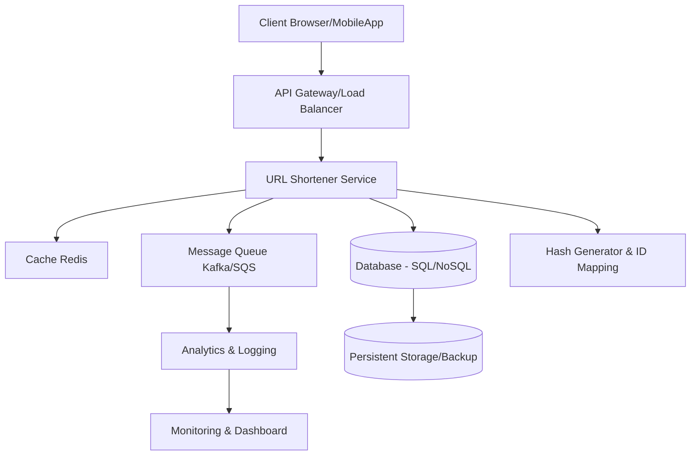
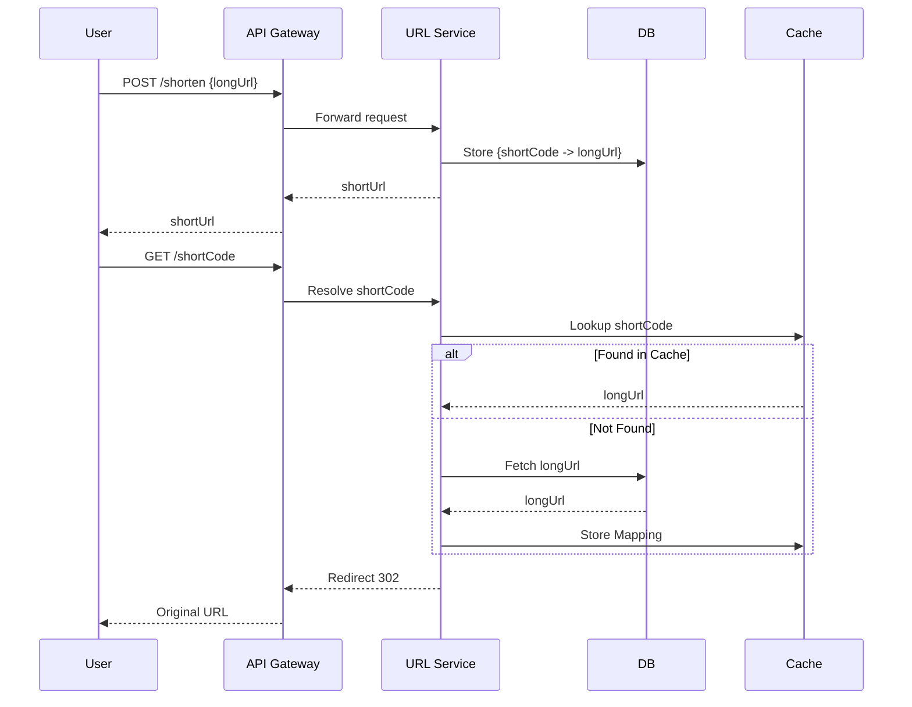

# URL Shortener - High Level Design (HLD)

## 1. Overview

A URL Shortener is a service that converts long URLs into short, unique aliases. These shortened URLs can be easily shared and redirected to the original long URL. Popular examples include **bit.ly** and **tinyurl.com**.

---

## 2. Requirements

### Functional Requirements

* Shorten a given long URL into a unique short URL.
* Redirect users from a short URL to the original long URL.
* Support custom aliases (optional).
* Track analytics (click count, timestamps, user data).

### Non-Functional Requirements

* High availability and scalability.
* Low latency for redirects.
* Reliability and fault tolerance.
* Consistent hashing/distribution for scalability.

---

## 3. API Design

**1. Create Short URL**

```http
POST /shorten
Request: { "longUrl": "https://example.com/abc" }
Response: { "shortUrl": "https://sho.rt/xyz123" }
```

**2. Redirect**

```http
GET /{shortCode}
Response: 302 Redirect → Original Long URL
```

**3. Analytics (Optional)**

```http
GET /analytics/{shortCode}
Response: { "clicks": 1200, "createdAt": "2025-09-20" }
```

---

## 4. High Level Architecture



---

## 5. Database Design

* **ShortURL Table**

    * `shortCode` (Primary Key)
    * `longUrl`
    * `createdAt`
    * `expiryDate` (optional)
    * `clickCount`

* **Analytics Table** (Optional)

    * `shortCode`
    * `timestamp`
    * `userInfo`

---

## 6. Key Design Decisions

1. **Short Code Generation**

    * Base62 encoding (0-9, a-z, A-Z).
    * Hashing (MD5, SHA256) with collision handling.
    * Incremental ID + encoding.

2. **Database Choice**

    * **NoSQL Key-Value Store** (e.g., DynamoDB, Cassandra, Redis) for fast lookup.
    * Relational DB possible but less scalable.

3. **Caching**

    * Frequently accessed short codes stored in Redis.
    * Reduces database load and improves latency.

4. **Scalability**

    * Use consistent hashing/sharding for DB scaling.
    * CDN for global availability.
    * Load balancers for traffic distribution.

5. **Fault Tolerance**

    * Replication of DB.
    * Retry mechanism with exponential backoff.
    * Circuit breaker patterns.

---

## 7. Capacity Estimation (Example)

* Assume 500M new URLs per month.
* Average URL length = 100 bytes.
* Storage needed per month ≈ 500M \* 100B ≈ 50 GB (excluding metadata).
* With replication (x3) → 150 GB/month.

---

## 8. Sequence Diagram



---

## 9. Future Enhancements

* Expiring short URLs.
* User authentication & custom short URLs.
* Analytics dashboard.
* QR code generation.

---

## 10. Conclusion

A URL shortener is a **read-heavy, latency-sensitive system**. Key aspects include efficient short code generation, caching for low-latency redirects, and scalable storage. With proper caching, replication, and sharding, the system can scale to billions of requests per day.
