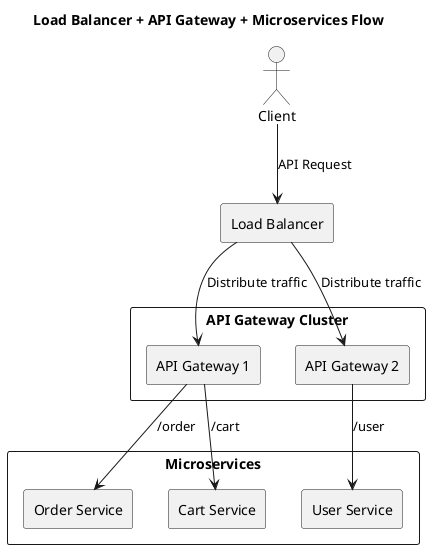

# Load Balancer vs API Gateway

## Difference

| Aspect              | Load Balancer                                      | API Gateway                                       |
|---------------------|---------------------------------------------------|--------------------------------------------------|
| **Primary Role**    | Distributes traffic across multiple servers        | Manages, secures, and routes API calls           |
| **Layer**           | Network / Transport (L4) or Application (L7)       | Application Layer (L7)                           |
| **Key Features**    | - Round-robin, least connections, IP hash   - Health checks   - SSL termination | - Authentication, rate limiting   - Request/response transformation   - Routing to microservices |
| **Placement**       | In front of multiple API Gateway or app servers    | In front of microservices                        |
| **Focus**           | Availability, scalability                          | Security, request management, service discovery  |

---

## Typical Deployment

A **Load Balancer** usually sits in front of multiple **API Gateways**, and the gateways then route traffic to the correct microservice.

